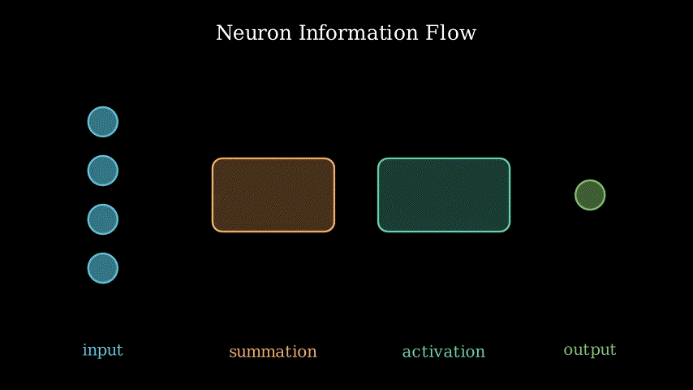

# 2025 Summer School for Astrostatistics in Crete

Notebooks from the teaching sessions and the workshops of the
[2025 Summer School for Astrostatistics in Crete](https://astro.physics.uoc.gr/Conferences/Astrostatistics_School_Crete_2025/).

<p align="center">
  
  
  
</p>

## Getting Started

The school material is a collection of Jupyter notebooks, organized in one
folder per subject. The data are also provided in the repository. You can view
and use the material by either:
* Installing the package (see "Installing" below)
* Manually downloading the material and use it (see "Downloading without
  installation" below)

## Installing

The environment is based on Python 3.12 and all packages are installed via `pip`
using a `conda` environment.

### Clone the repository

First, clone the repository and enter the project directory:

```bash
git clone https://github.com/astrostatistics-in-crete/2025_summer_school.git
cd astrostat25_summer_school
```

### Create the conda environment

Make sure you have Miniconda or Anaconda installed.

Then, create the environment using the provided environment.yml file:

```bash
conda env create -f environment.yml
```

This will create a new environment named "astrostat25" with Python 3.12, and
install all required packages via pip.

### Activate the environment

Once created, activate the environment with:

```bash
conda activate astrostat25
```

## Register the kernel with Jupyter

After activating the environment, register it as a Jupyter kernel so it can be
used in notebooks or in VSCode:

```bash
python -m ipykernel install --user --name=astrostat25 --display-name="astrostat25"
```

This will make "astrostat25" appear as an available kernel in both the
Jupyter interface and the VSCode Python kernel selector.

### Launch Jupyter Notebook

You can now start the notebook interface from inside the environment:

```bash
jupyter notebook
```

## Downloading without installation

If you prefer not to install the environment locally, you can still access and
view the notebooks with the methods listed below.

> NOTE: Interactive figures (e.g., Plotly, ipywidgets) may not display as intended.

### 1. View notebooks directly on GitHub

GitHub natively renders `.ipynb` files as static HTML. Simply navigate to any
notebook file in the repository to view its contents.

> NOTE: Some figures are embedded in the notebooks, so they will only be visible
when the notebooks are downloaded and opened locally—they will not be displayed
on GitHub.

### 2. Use the "Open in nbviewer" browser extension

For a quick inspection, you can install a browser extension that allows you to
open Jupyter Notebooks directly in your browser:

- [Jupyter Notebook Viewer for Chrome](https://chromewebstore.google.com/detail/jupyter-notebook-viewer/ocabfdicbcamoonfhalkdojedklfcjmf)
- [Python Notebook Viewer for Firefox](https://addons.mozilla.org/en-US/firefox/addon/python-notebook-viewer/)

After installing the extension, simply open a `.ipynb` file in your browser to
view it rendered as a notebook.

## Authors

In alphabetical order:

* **Bonfini Paolo, Dr.** - Alma Sistemi (Italy)

* **Koutulaki Maria, Dr.** - University of Leeds (UK)

* **Kostantinos Kovlakas, Dr** - Institute of Space Sciences (CSIC, IEEC; Spain)

* **Maravelias Grigoris, Dr.** - PeriAstron (Greece) & FORTH (Greece)

* **Tersenov Andreas, PhD candidate** - FORTH (Greece) & CEA Paris-Saclay (France)

* **Vernardos Giorgos, Prof.** - Lehman College, City University of New York & AMNH (USA)

## References

All the material provided here (notebooks and scripts) is licenced
under the GNU GPLv3.

The notebooks have adopted publicly available material from several sources
that are properly credited. All the references to published papers, data, and
software tools are properly addressed within each notebook.

## Acknowledging the school

If the material you learned through this summer school directly and
significantly contributed to your work, we invite you to include the
following acknowledgement in your manuscript:

> We wish to thank the "Summer School for Astrostatistics in Crete" for
providing training on the statistical methods adopted in this work.

